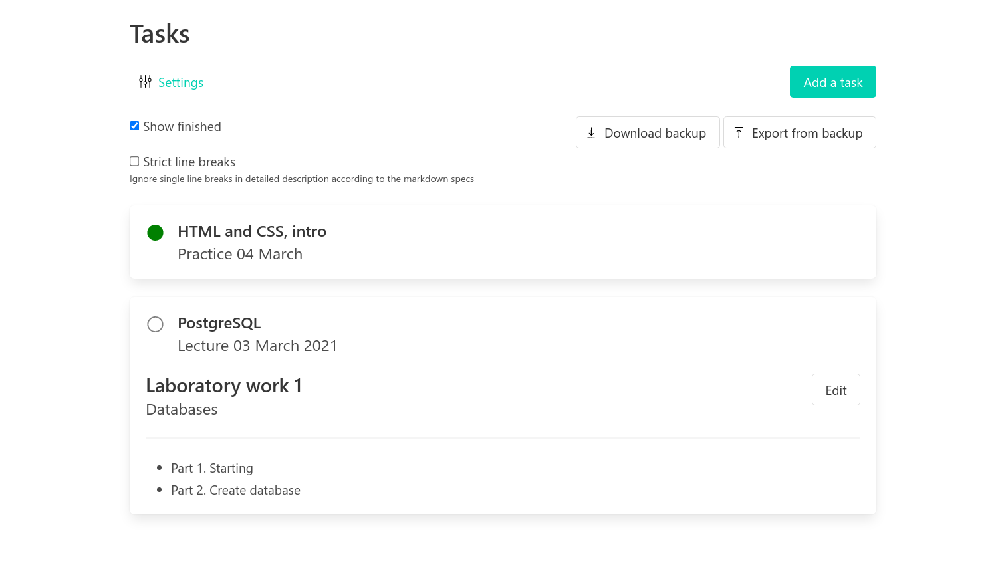
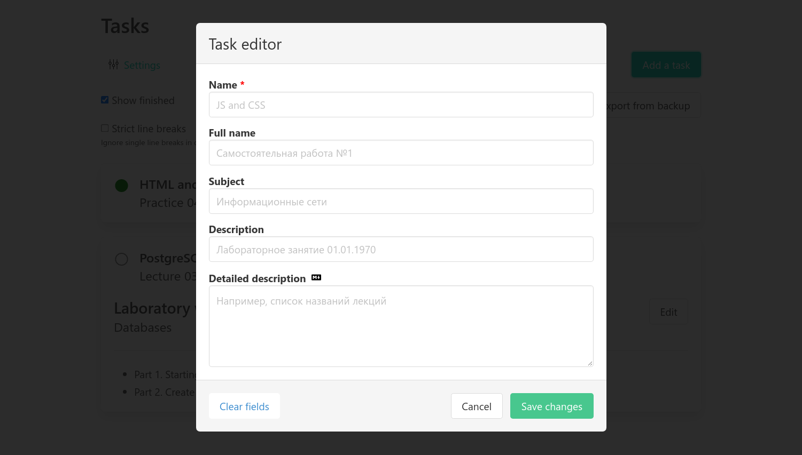

# Tasker

**How it looks**

<div align="center">
	
	
</div>

## Running

**In docker container**

*I don't know how to link containers without docker-compose, so*

1. Clone the [repository](https://github.com/istudyatuni/tasker)

```bash
git clone -b release https://github.com/istudyatuni/tasker.git
cd tasker
```

*or, without history (less repository size)*

```bash
git clone -b release --single-branch --depth=1 https://github.com/istudyatuni/tasker.git
cd tasker
```

2. Run migrations for the database (only if this is the first run)

```bash
./scripts/setup-db.sh
```

3. Run app

```bash
docker-compose up -d tasker
```

Then open http://localhost:11697

*If you want to manage your database (e.g. delete tasks), you also need to run adminer:*

```bash
docker-compose up -d tasker adminer
```

The adminer interface will be opened on http://localhost:8080

System - `PostgreSQL`, server - `db`, username and password: `postgres`, database - `tasker_repo`

**In development mode**

1. PostgreSQL in docker:

```bash
docker-compose up adminer
```

2. Elixir server:

```bash
cd server
# dependencies
mix deps.get
iex -S mix

# run migrations in dev db
../scripts/migrate.sh
```

3. Web app

```bash
cd web
yarn install
yarn start
```

Or, run script for running commands in `tmux`:

```bash
./scripts/dev.sh
```

Then open http://localhost:8000

*See also [`server/README.md`](server/README.md)*

## Comparison of React + TS and Svelte + JS usage in this project

Counted with [tokei](https://github.com/XAMPPRocky/tokei)

```
$ tokei

===============================================================================
 Language            Files        Lines         Code     Comments       Blanks
===============================================================================
 TSX                    10          546          471           12           63
 TypeScript             22          597          442           70           85
 Total                  32          1143         913           82           148
===============================================================================
 JavaScript             17          400          326           16           58
-------------------------------------------------------------------------------
 Svelte                 10          265          226            5           34
 |- JavaScript          10          125           95            1           29
 Total                  27          790          647            22          121
```

Commit for TypeScript: [`759230c`](https://github.com/istudyatuni/tasker/tree/759230c), for Svelte and JavaScript: [`8628398`](https://github.com/istudyatuni/tasker/tree/8628398)
